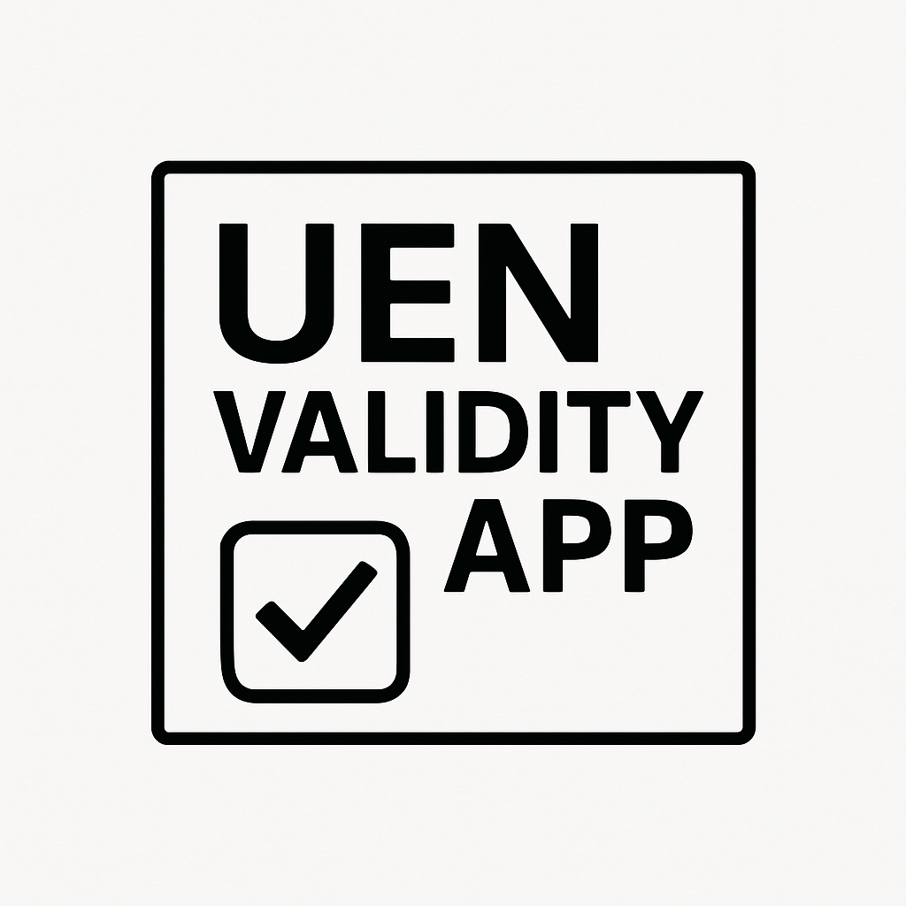
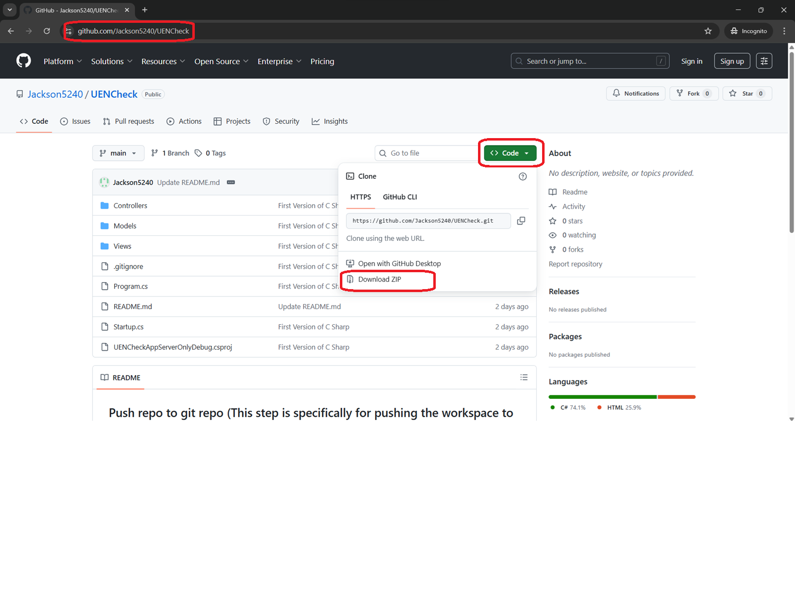
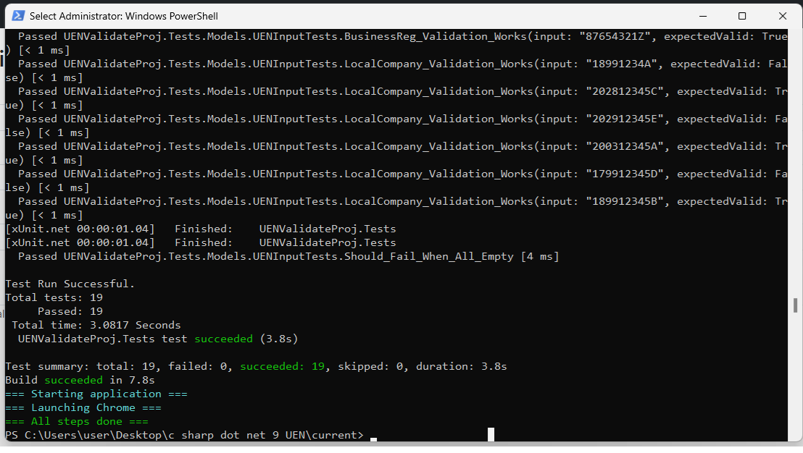
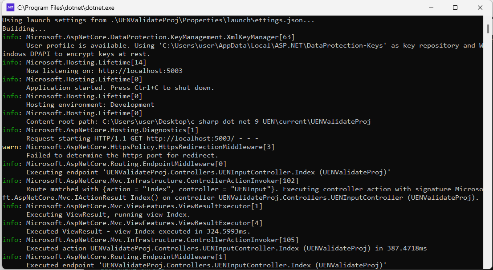
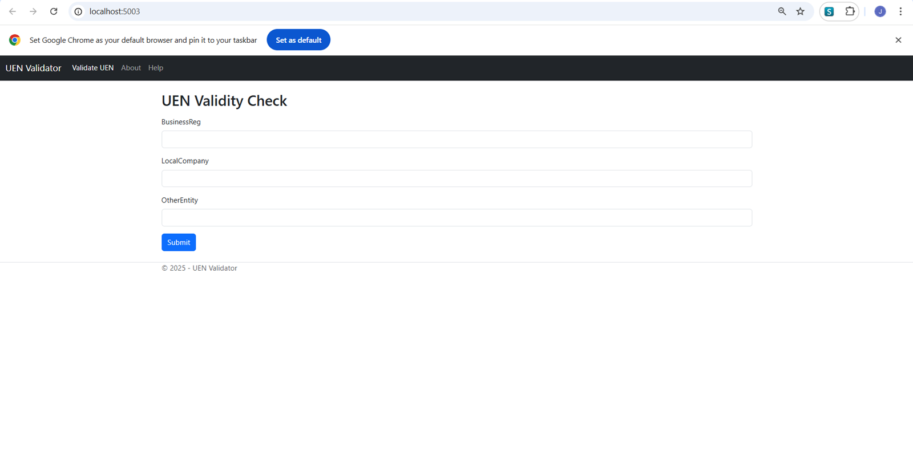
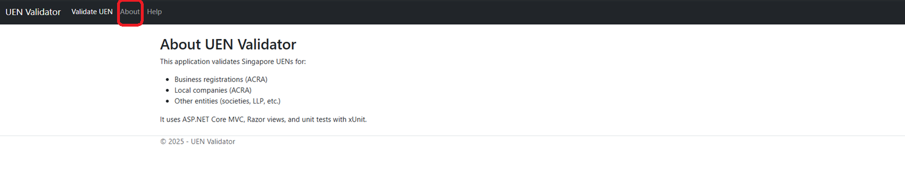
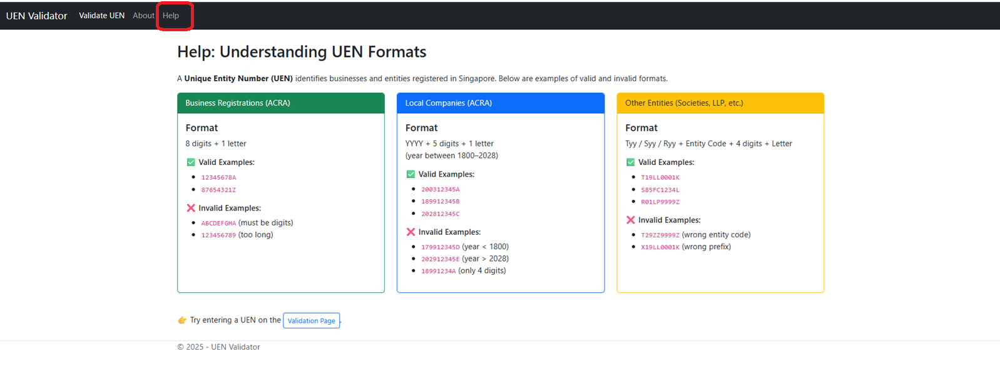
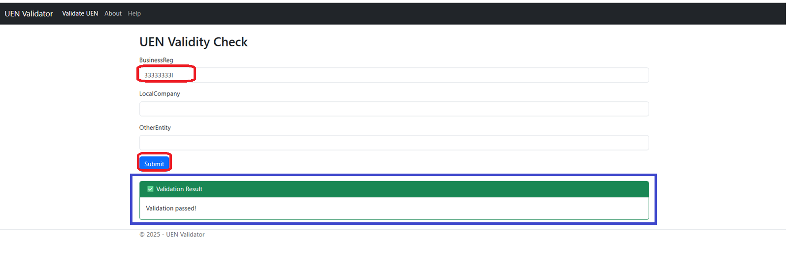
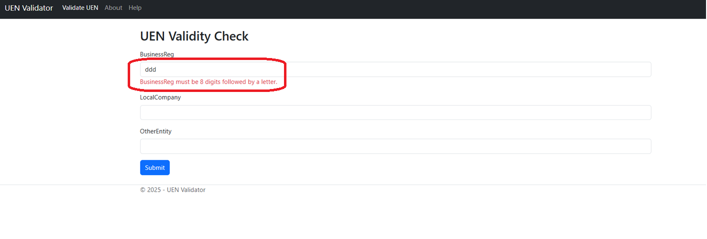
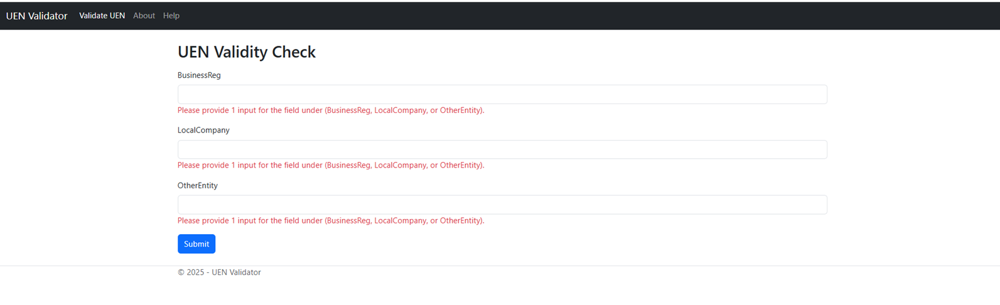

# 🚀 My Project



Welcome to **My Project for UEN Validator App**!  
This README has a clickable **Table of Contents**, section headers. 

**Background Information**: This app is built for organization to validate the UEN of the company. 

---

## 📑 Table of Contents
- [Prerequisite](#prerequisite)
- [Download Project From Git Repo Link](#download-project-from-git-repo-link)
- [Deploying Application Locally](#deploying-application-locally)
- [Application Overview](#application-overview)
- [Demo & Walkthrough](#demo--walkthrough)

---

## Prerequisite

1) Required **.NET 9.0** to be installed

2) Downloadable link for **.NET 9.0** if required: https://dotnet.microsoft.com/en-us/download/dotnet/9.0

3) Recommeded to run in **Windows** Environment for this Project

4) Chrome Browser is installed

## Download Project From Git Repo Link

#### GitHub Repositiory (Option 1)

1) Launched Browser and go to this link: https://github.com/Jackson5240/UENCheck

2) From the medium pane, click on "Code" and click on "Download Zip"



3) Extract the zip file (Note: For zip extraction, click on "Extract here" option)

#### Git Clone from Repo (Option 2)

1) Open Powershell and run the following command to clone the repo

```
git clone https://github.com/Jackson5240/UENCheck.git
```

## Deploying Application Locally

#### Run "runapp.ps1" (Option 1)

1) Open Powershell (Recommended to run as Administrator) and run the following command

```
## Go to the root folder of the project ( UENCheck or UENCheck-main )
cd <root folder>

## Run script
.\runapp.ps1
```
###### Script logic flows for runapp.ps1
 - Clears all NuGet caches
   
 - Remove bin/obj folders if they exist
   
 - Clean Solution
   
 - Build Solution
   
 - Run unit test


 
 - Run the application on the background



 - Launch the Application from Chrome



#### Run manually on Powershell (Option 2)

1) Open Powershell (Recommended to run as Administrator) and run the following command

```
## Go to the root folder of the project ( UENCheck or UENCheck-main )
cd <root folder>

## Clears all NuGet caches
dotnet nuget locals all --clear

## Remove bin/obj folders if they exist (Note: Run if the bin/obj folders exist)
Remove-Item -Recurse -Force .\UENValidateProj\bin
Remove-Item -Recurse -Force .\UENValidateProj\obj
Remove-Item -Recurse -Force .\UENValidateProj.Tests\bin
Remove-Item -Recurse -Force .\UENValidateProj.Tests\obj

## Clean Solution
dotnet clean

## Build Solution
dotnet build

## Run unit tests
dotnet test

## Once unit test is done, run app (Alternatively open another powershell instance to run this command to run in conjection as the unit test is still performing test)
Start-Process -FilePath "dotnet" -ArgumentList "run --project .\UENValidateProj\UENValidateProj.csproj"
```

2) Launched Chrome and hit the brower with this url: http://localhost:5003

## Application Overview

#### UEN Validator Page


#### Additional Information for UEN Validator Page



#### UEN format Validaty Example



## Demo & Walkthrough

#### UEN successfuly validated
Key in the UEN to one of the field and click on "**Submit**" to check validaty



#### UEN fails validation



#### Submitting of empty field


